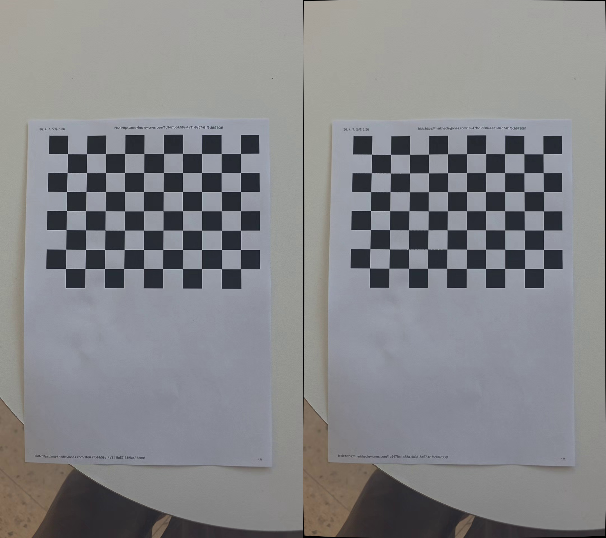

# Precise Camera Calibrator

## Description
OpenCV를 활용하여 스마트폰 카메라의 내부 파라미터를 추정하고, 이를 바탕으로 렌즈 왜곡을 보정하는 프로그램입니다.

## Features
* **카메라 캘리브레이션 (`camera_calibration.py`)**
  * 입력된 동영상 파일에서 불필요한 연산을 줄이기 위해 일정 프레임 간격으로 체스보드 패턴을 인식하고 코너를 검출합니다.
  * `cv2.cornerSubPix`를 이용한 정밀 보정을 통해 픽셀 단위보다 더 정확한 카메라 매트릭스(Camera Matrix)와 왜곡 계수(Distortion Coefficients)를 산출합니다.
  * 연산이 완료되면, 이후 왜곡 보정 프로그램에서 해당 파라미터를 손쉽게 불러올 수 있도록 결과값들을 묶어 `calib_data.npz` 파일로 자동 저장합니다.

* **렌즈 왜곡 보정 (`distortion_correction.py`)**
  * 앞서 생성된 `calib_data.npz` 파일의 캘리브레이션 데이터를 불러와 원본 영상의 렌즈 왜곡을 실시간으로 보정(Undistort)합니다.
  * 보정 전(Original)과 보정 후(Rectified)의 영상을 가로로 나란히 이어 붙여 화면에 출력함으로써 렌즈 왜곡이 얼마나 펴졌는지 시각적으로 쉽게 비교할 수 있습니다.
  * 프로그램 실행 시, 결과물 확인 및 과제 데모 첨부용으로 사용하기 위해 비교 화면의 첫 프레임을 `rectified_demo.jpg` 파일로 자동 캡처하여 저장합니다.

## Camera Calibration Results
캘리브레이션을 통해 산출된 카메라 내부 파라미터(Intrinsic Parameters) 결과입니다.

* **RMS Error (RMSE)**: 0.801446021604727
* **$f_x$ (초점거리 x)**: 1724.61380
* **$f_y$ (초점거리 y)**: 1726.26746
* **$c_x$ (주점 x)**: 568.816625
* **$c_y$ (주점 y)**: 927.443498
* **Distortion Coefficients (왜곡 계수)**: [ 0.05616797, -0.56862734, -0.00102378, 0.00202997, 1.06479509 ]

## Distortion Correction Demo
좌측은 왜곡 보정 전 원본(Original) 이미지이며, 우측은 캘리브레이션 파라미터를 적용하여 왜곡을 펴낸(Rectified) 이미지입니다.

> **Note**: 촬영에 사용한 카메라 렌즈 자체의 왜곡이 매우 적거나 내부 소프트웨어 보정이 이미 적용되어 있어, 원본과 보정본 간의 시각적인 형태 차이가 거의 발생하지 않았습니다.